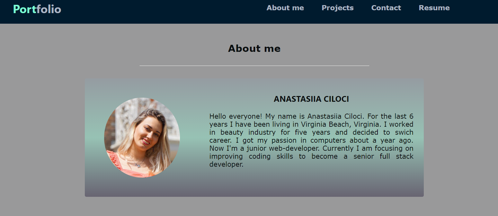
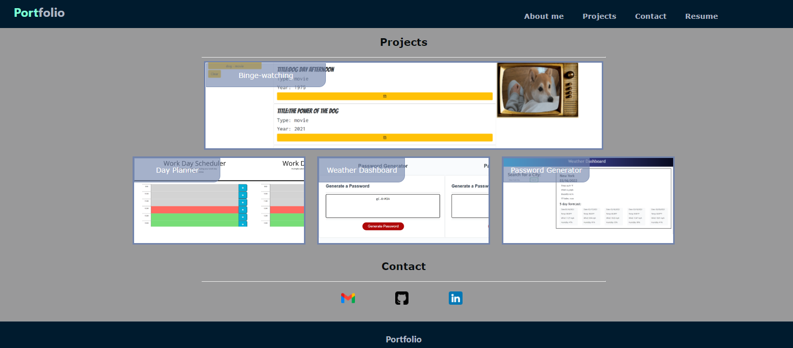

# Advanced-Portfolio

## Table of content:

1. [Description](#description)
2. [Visuals](#visuals)
3. A [link](https://anastasiia-ciloci.github.io/Advanced-Portfolio/) to an advanced portfolio

# Description

This is a professional portfolio of me. It includes the main projects I did in the last few month.

## Visuals

# A link to the [Advanced Portfolio](https://anastasiia-ciloci.github.io/Advanced-Portfolio/)

Or click [here](https://anastasiia-ciloci.github.io/Advanced-Portfolio/) to open a portfolio.
